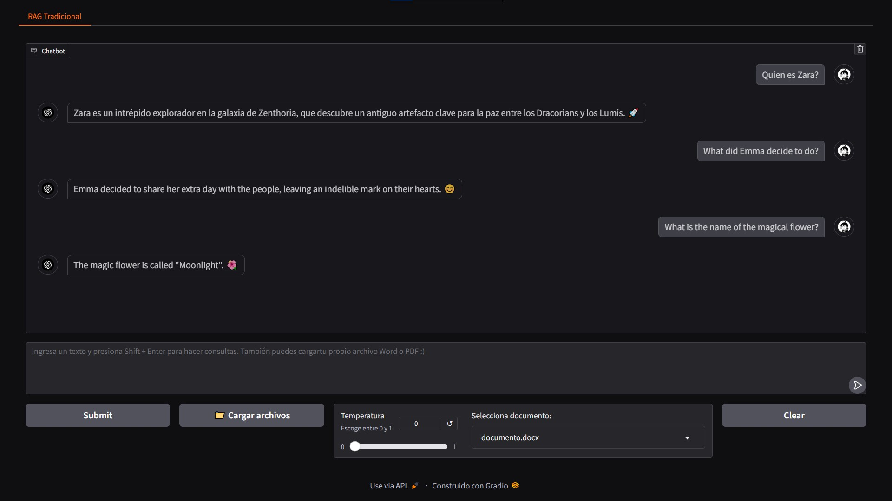
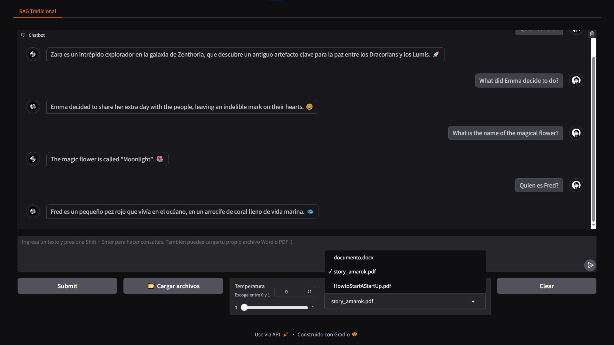

# 🚀 RAG Tradicional con Langchain y Gradio🌟
¡Bienvenido al proyecto! 🎉 Este repositorio contiene una implementación de una API que utiliza **Gradio** para procesar preguntas, buscar texto relevante y generar respuestas utilizando un modelo de lenguaje grande (LLM). La aplicación se integra con **Cohere** para la generación de embeddings, **ChromaDB** para la búsqueda de similitudes y **Gradio** como interfaz para seleccionar el documento y realizar consultas.

## 🧠 Principales Insights o Mejoras del Proyecto
- **Framework de Langchain y Cohere para el procesamiento de consultas**: Langchain y Cohere se emplean para el procesamiento avanzado de consultas, optimizando la interacción con los documentos y generando respuestas precisas basadas en el contenido cargado.
- **Carga de Archivos mediante Gradio**: La interfaz permite cargar archivos de manera intuitiva usando Gradio, soportando formatos como `.pdf` y `.docx`. Los archivos se indexan automáticamente en ChromaDB para realizar consultas.
- **Procesamiento de documentos "docx." y "pdf."**: Se ha implementado un sistema de carga y procesamiento de documentos `.docx` y `.pdf` de forma eficiente. Los archivos se almacenan en una base de datos para facilitar su consulta posterior.
- **Interfaz amigable para usuarios No Técnicos**: La interfaz está diseñada para ser simple y accesible, permitiendo que cualquier usuario, sin conocimientos técnicos, pueda cargar documentos y hacer consultas de manera fluida.
- **Mejora de Embeddings a multilingual**: Se ha mejorado el sistema de embeddings para ofrecer soporte multilingüe, permitiendo consultas en varios idiomas y garantizando una mayor versatilidad en el uso global de la herramienta.
- **Mejora de llamado de ChromaDB**: Se ha optimizado la manera en que se interactúa con ChromaDB, mejorando la velocidad de indexación y la precisión en las búsquedas, lo que resulta en un rendimiento más rápido y confiable durante las consultas.


## 🌟 Características principales
- 🗂️ Procesamiento de documentos `.docx` y `.pdf` para extraer información relevante.  
- 🔍 Almacenamiento de embeddings en **ChromaDB** para búsqueda eficiente de similitudes.  
- 🤖 Respuestas concisas y personalizadas generadas con modelos LLM.  
- 📦 Despliegue simplificado con Docker.  


## 📂 Estructura del proyecto
```console
📁 app  
├── cargar_en_chroma_db.py  # Carga y almacenamiento de documentos en ChromaDB.
├── config.py               # Gestión y validación de variables de entorno.
├── inicializar_db.py       # Inicialización y combinación de documentos preprocesados.
├── models.py               # Definición de los modelos de datos.
├── services.py             # Conjunto de funciones para procesar las consultas.
📁 Archivos de Referencia
├── Traditional_Rag_vs_Agentic_Rag.gif # Ejemplo de Flujo de proceso en Rag Tradicional y Rag con Agentes.
📁 chroma_db
├── preprocessed/           # Base de datos de embeddings para documentos preprocesados.
├── uploaded/               # Base de datos de embeddings para documentos cargados.
📁 documents
├── preprocessed/           # Documentos ya procesados.
├── uploaded/               # Documentos cargados por el usuario.
📁 images		    # Conjunto de imagenes para el chatbot y de ejemplo.
Dockerfile                  # Configuración para construir la imagen Docker.
main.py                     # Archivo principal de la aplicación.
requirements.txt            # Librerías requeridas.
```

## 🚀 Cómo ejecutar el proyecto
### 1️⃣ Requisitos previos
- 🐍 Python 3.9+  
- 🐳 Docker instalado.  

### 2️⃣ Ejecución local
1. Clona el repositorio:
```console
git clone https://github.com/BryanGuerraS/Traditional-RAG-with-Gradio-Upload-Files.git
cd Traditional-RAG-with-Gradio-Upload-Files
```
2. Crea un entorno virtual e instala las dependencias:
```console
python -m venv env
source env/bin/activate  # En Windows: .\venv\Scripts\activate
pip install -r requirements.txt
```

3. Crea un archivo **.env** en la raíz del proyecto con las siguientes claves:
```console
LANGCHAIN_API_KEY=tu_clave_aqui
COHERE_API_KEY=tu_clave_aqui
```

4. Inicia la API
```console
uvicorn main:app --reload
```
5. Prueba la API
Prueba la API en: http://127.0.0.1:7860/

### 3️⃣ Ejecución con Docker
1. Construye la imagen Docker:
```console
docker build -t rag_gradio .
```
2. Ejecuta el contenedor:
```console
docker run -p 8000:8000 rag_gradio
```
3. Prueba la API:
- La API estará disponible en: http://127.0.0.1:7860/


## 🛠️ Endpoints principales
### Principales preguntas:
- Procesa una pregunta y genera una respuesta basado en el documento seleccionado.


- Permite cargar archivos nuevos y cambiar el documento seleccionado.



## 📖 Documentación adicional
- Docker: Este proyecto incluye un archivo Dockerfile que permite desplegar la API rápidamente en un contenedor.
- Módulos separados: Código modular y bien documentado para facilitar su mantenimiento y escalabilidad.

## 🌍 Contribuciones
¡Las contribuciones son bienvenidas! Si encuentras un problema o deseas agregar una mejora, por favor abre un issue o envía un pull request. 🙌